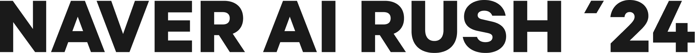

# NAVER AI RUSH 클론 웹페이지

## 💡 프로젝트 소개

이 페이지는 NAVER AI RUSH 프로그램을 소개하는 공식 사이트를 바탕으로 제작된 
클론 페이지입니다.
GSAP, Swiper, jQuery 등 다양한 기술을 사용하여 실제 웹처럼 동작하도록 구성했습니다.

### 🚀 사용 기술

- HTML5 / CSS3 (Reset, Layout, Media Query)
- JavaScript (ES6+)
- jQuery
- GSAP + ScrollTrigger + AOS
- Swiper.js (슬라이더)
- 반응형 웹 구현 (미디어 쿼리)

### 🧩 주요 기능

- 로딩 애니메이션
- 섹션별 고정/스크롤 효과
- 모바일 메뉴, 검색 모달
- 다크모드 스타일 전환
- Swiper 슬라이더
- 반응형 대응

### 📁 폴더 구조

```bash
복사편집
project/
├── index.html
├── css/
│   ├── reset.css
│   ├── common.css
│   ├── layout.css
│   ├── media.css
│   └── style.css
├── js/
│   └── script.js
├── img/
│   └── (이미지, 영상들)

```

> 🧩 역할 별 코드 정리
> 
- `reset.css` : 브라우저 기본 초기화
- `layout.css` : 전체 구조 및 배치
- `script.js` : GSAP/ScrollTrigger/JQuery 활용 인터랙션
- `media.css` : 화면 크기별 반응형 처리
- `common.css` : 공통 텍스트 및 버튼 스타일
- `index.html` : 전체 페이지 구조

## CODE

### html

```html
<!DOCTYPE html>
<html lang="en">

<head>
  <!-- 문자 인코딩과 뷰포트 설정 -->
  <meta charset="UTF-8">
  <meta name="viewport" content="width=device-width, initial-scale=1.0">
  <title>NAVER AI RUSH</title>
  <!-- 외부 CSS 연결 -->
  <link rel="stylesheet" href="./css/style.css">
</head>

<body>

  <!-- 🔸 로딩 화면 (페이지 로드 중에 보여짐) -->
  <div class="loading">
    <div class="loading-progress">
      <span></span>
    </div>
  </div>

  <!-- 🔸 모바일 내비게이션 메뉴 (햄버거 메뉴 클릭 시 열림) -->
  <div class="modal-nav">
    <ul class="nav-list">
      <li><a href="#">ai rush</a></li>
      <li><a href="#">ai biz</a></li>
      <li><a href="#">ai study</a></li>
      <li><a href="#">notice</a></li>
    </ul>
  </div>

  <!-- 🔸 모달 메뉴 뒤의 어두운 배경 -->
  <div class="overlay"></div>

  <!-- 🔸 상단 헤더: 로고 + 내비게이션 -->
  <header>
    <div class="inner">
      <!-- 로고 -->
      <h1>
        <a href="#" class="logo-link">
          <span class="blind">naver ai rush</span>
        </a>
      </h1>

      <!-- 내비게이션 메뉴 (데스크탑용) -->
      <nav>
        <ul class="nav-list">
          <li><a href="#">ai rush</a></li>
          <li><a href="#">ai biz</a></li>
          <li><a href="#">ai study</a></li>
          <li><a href="#">notice</a></li>
        </ul>
        <!-- 검색 버튼 -->
        <a href="#" class="btn sch-btn">sch-btn</a>
        <!-- 모바일용 햄버거 버튼 -->
        <a href="#" class="btn mob-nav-btn">mobile btn</a>
      </nav>
    </div>

    <!-- 🔸 검색 모달 (검색 아이콘 클릭 시 나타남) -->
    <div class="sch-modal">
      <div class="sch-box">
        <button class="btn sch-modal-btn">
          <span class="blind">검색하기</span>
        </button>
        <input type="text" class="sch-bar" autofocus placeholder="관심있는 주제나 키워드를 검색해 보세요">
      </div>
    </div>
    <div class="sch-modal-bg"></div>
  </header>

  <!-- 🔹 인트로(고정 배경) 섹션 -->
  <section class="fixed-section">
    <div class="inner">
      <div class="t-wrap">
        <!-- 로고 이미지 -->
        <h2 class="s-tit">
          
        </h2>
        <!-- 프로그램 소개 문구 -->
        <p class="s-txt">
          네이버 AI RUSH는 미래를 향한 다양한 파트너가 모여 <br>
          AI 기술, 경험, 노하우를 나누고<br class="mob-only"> 성장을 이어가는 프로그램입니다.
        </p>
        <!-- CTA 버튼 -->
        <a href="#" class="btn gradient">ai study 시작하기</a>
      </div>
    </div>

    <!-- 🔸 영상 롤링 영역 (백그라운드 영상 반복) -->
    <div class="rolling-wrap">
      <div class="rolling-in">
        <!-- 영상 반복 출력 -->
        <video autoplay muted loop class="rolling-content">
          <source src="./img/spot_rolling_01.mp4" type="video/mp4">
        </video>
        <!-- ... 동일한 형식으로 영상 여러 개 나열됨 ... -->
      </div>
    </div>
  </section>

  <!-- 🔹 메인 콘텐츠 영역 시작 -->
  <div id="container">

    <!-- ✅ SECTION 1: AI 기술 트렌드 소개 -->
    <section class="sc-section sc-section-1">
      <div class="inner">
        <h2 class="s-tit" data-aos="fade-up">
          주목해야할 AI 기술 흐름을 테마로 선정해 <br>
          다양한 AI 리더 그룹과 함께 <br>
          새로운 인사이트를 발견합니다.
        </h2>

        <div class="flex-wrap">
          <p class="s-txt">
            대학생 앰배서더와 스타트업 파트너가 모여 <br>
            함께 나눈 HyperCLOVA X의 경험과 트렌드를 확인해보세요.
          </p>

          <!-- 슬라이드 좌우 버튼 -->
          <div class="arr-wrap">
            <div class="swiper-button-prev"></div>
            <div class="swiper-button-next"></div>
          </div>
        </div>

        <!-- 🔸 슬라이더 영역 -->
        <div class="sc1-slider-wrap">
          <div class="swiper sc1-slider">
            <div class="swiper-wrapper">
              <!-- 슬라이드 카드 1 -->
              <div class="swiper-slide" data-aos="fade-up">
                <a href="#">
                  <div class="img-wrap">
                    
                  </div>
                  <div class="t-wrap">
                    <h3>Ai를 일상에 적용하는 법 : 대학생 편</h3>
                    <p class="txt">
                      <span>채널테크</span>
                      <span>앰배서더 활동 후기</span>
                    </p>
                  </div>
                </a>
              </div>
              <!-- 슬라이드 카드 2, 3 ... 생략 가능 -->
            </div>
          </div>
        </div>
      </div>
    </section>

    <!-- ✅ SECTION 2: 앰배서더 혜택 -->
    <section class="sc-section sc-section-2">
      <div class="inner">
        <div class="t-wrap">
          <h2 class="s-tit" data-aos="fade-up">
            <span>AI 기술에 관심있는 대학생 앰배서더들과</span>
            <span><a href="#" class="gradient-link">HyperCLOVA X</a>의 사용 경험을 나누며</span>
            <span>AI 리더로 성장할 수 있는 기회를 만들어갑니다.</span>
          </h2>
        </div>

        <!-- 🔸 혜택 카드 리스트 -->
        <ul class="sc2-lst">
          <li data-aos="fade-up">
            <div class="img-wrap">
              
            </div>
            <div class="card-txt-wrap">
              <h3>AI 활용 <br> 포트폴리오 도출</h3>
              <p>HyperCLOVA X를 활용하여 다양한 콘텐츠를 기획하고 제작해 볼 수 있습니다.</p>
            </div>
          </li>
          <!-- 나머지 혜택 카드들 생략 가능 -->
        </ul>

        <!-- 🔸 지원 자격 안내 -->
        <div class="info-wrap info-wrap-1">
          <h4 data-aos="fade-up">앰배서더 지원 자격</h4>
          <ul class="info-lst">
            <li data-aos="fade-up">재학 중인 대학생 및 대학원생 2~4명 팀</li>
            <li data-aos="fade-up" data-aos-delay="50">7~9월 앰배서더 활동 가능자</li>
            <li data-aos="fade-up" data-aos-delay="100">AI 기술 트렌드에 관심 있는 분</li>
          </ul>
        </div>
      </div>
    </section>

    <!-- ✅ SECTION 3: 활동 구조 및 일정 -->
    <section class="sc-section sc-section-3">
      <div class="inner">

        <!-- 🔸 활동 3단계 소개 -->
        <div class="info-wrap info-wrap-2">
          <h4 data-aos="fade-up">총 3단계 성장 프로그램이 진행됩니다.</h4>
          <ul class="info-lst">
            <li>
              <em class="num">01</em>
              <div class="in">
                <h5>AI 아이디어 도출</h5>
                <p>일상, 전공, 사회</p>
              </div>
            </li>
            <!-- 단계 2, 3 생략 가능 -->
          </ul>
        </div>

        <!-- 🔸 활동 주제 설명 -->
        <div class="info-wrap info-wrap-3">
          <h4 data-aos="fade-up">
            HyperCLOVA X를 활용하여 다양한 주제로<br class="mob-only">
            AI 아이디어 제안과 콘텐츠 기획을 할 수 있습니다.
          </h4>
          <ul class="info-lst">
            <li data-aos="fade-up">
              <h5>AI Experience</h5>
              <p class="sm-tit">일상에서 출발한 AI 아이디어</p>
            </li>
            <!-- 나머지 항목 생략 -->
          </ul>
        </div>

        <!-- 🔸 전체 일정 -->
        <div class="info-wrap info-wrap-4">
          <h4>진행일정</h4>
          <ul class="info-lst">
            <li data-aos="fade-up">
              <div class="left">
                <em class="num">1</em>
                <h5>앰배서더 참가 지원</h5>
              </div>
              <div class="right">
                <div class="date">7월 3일까지</div>
              </div>
            </li>
            <!-- 일정 2~3 생략 -->
          </ul>
        </div>
      </div>
    </section>
  </div>

  <!-- ✅ 참여 결과물 섹션 -->
  <section class="result-section">
    <div class="inner">
      <div class="t-wrap">
        <h2 class="s-tit" data-aos="fade-up">
          AI RUSH 프로그램에 참여한<br>
          스타트업 Demo 및<br class="mob-only"> 대학생 앰배서더 결과물입니다.
        </h2>
        <!-- 우측 화살표 아이콘 링크 -->
        <a href="#" class="arrow"></a>
      </div>

      <!-- 결과물 리스트 -->
      <ul class="result-lst">
        <li>
          <a href="#">
            <div class="img-wrap">
              <!-- 결과물 비디오 -->
              <video class="card_video" autoplay muted loop playsinline preload="auto">
                <source src="./img/rush2024_biz_video_1.mp4" type="video/mp4">
              </video>
            </div>
            <div class="result-t-box">
              <h4 class="tit">캐릭터 AI 아바타 챗봇</h4>
              <p class="txt">굳갱랩스</p>
            </div>
          </a>
        </li>
        <!-- 다른 결과물 생략 -->
      </ul>
    </div>
  </section>

  <!-- ✅ 하단 푸터 -->
  <footer>
    <div class="inner in1">
      <div class="left">
        <h2 class="tit">
          네이버 AI와 <br class="mob-only"> HyperCLOVA X에 관한 <br>
          핵심 콘텐츠를 확인해보세요!
        </h2>
        <a href="#" class="qna">
          <span>자주 묻는 질문</span>
          <i class="ico"></i>
        </a>
      </div>
      <!-- CTA 버튼 -->
      <div class="btn gradient">ai study 시작하기</div>
    </div>
    <div class="inner in2">
      <div class="copy">ⓒ NAVER Cloud Corp.</div>
      <div class="info">
        <a href="#">개인정보처리방침</a>
        <a href="#">고객센터</a>
      </div>
    </div>
  </footer>

  <!-- 🔸 외부 라이브러리 (애니메이션, 슬라이더 등) -->
  <script src="https://unpkg.com/aos@next/dist/aos.js"></script>
  <script>
    AOS.init({
      duration: 1000
    });
  </script>
  <script src="https://cdnjs.cloudflare.com/ajax/libs/gsap/3.12.2/gsap.min.js"></script>
  <script src="https://cdnjs.cloudflare.com/ajax/libs/gsap/3.12.2/ScrollTrigger.min.js"></script>
  <script src="https://cdn.jsdelivr.net/npm/swiper@11/swiper-bundle.min.js"></script>
  <script src="https://cdnjs.cloudflare.com/ajax/libs/jquery/3.7.1/jquery.min.js"></script>
  <script src="./js/script.js"></script>

</body>
</html>

```

---

### css

### reset.css

```css
/* reset.css - 브라우저 기본 스타일 초기화 및 기본 폰트 세팅 */

/* 웹 폰트 및 외부 라이브러리 스타일 불러오기 */
@import url('https://fonts.cdnfonts.com/css/nanumsquare-neo'); /* 나눔스퀘어 네오 폰트 */
@import url('https://cdn.jsdelivr.net/npm/swiper@11/swiper-bundle.min.css'); /* swiper 슬라이더 스타일 */

/* 기본 폰트 크기를 62.5%로 지정 (1rem = 10px이 되도록 설정) */
html {
    font-size: 62.5%;
}

/* 수평 스크롤 방지 */
html, body {
    overflow-x: hidden;
}

/* 모든 요소에 margin, padding 제거하고 box-sizing 설정 */
* {
    margin: 0;
    padding: 0;
    box-sizing: border-box;
}

/* HTML5 시맨틱 태그들을 블록 요소로 설정 */
article,
aside,
details,
figcaption,
figure,
footer,
header,
hgroup,
menu,
nav,
section {
    display: block;
}

/* 기본 폰트 설정 */
body {
    line-height: 1; /* 줄 간격 기본값 */
    font-family: 'NanumSquare Neo', sans-serif; /* 기본 폰트 */
}

/* 리스트 스타일 제거 */
ol,
ul {
    list-style: none;
}

/* a 태그의 밑줄 제거 및 색상 상속 */
a {
    text-decoration: none;
    color: inherit;
}

/* 테이블 스타일 초기화 */
table {
    border-collapse: collapse; /* 테두리 겹침 제거 */
    border-spacing: 0;
}

/* 이미지와 비디오가 컨테이너보다 넘치지 않도록 설정 */
img,
video {
    max-width: 100%;
    height: auto;
}

/* 폼 요소의 기본 스타일 제거 */
button,
input,
optgroup,
select,
textarea {
    margin: 0;
    padding: 0;
    border: 0;
    font-size: 100%;
    font-family: inherit;
    vertical-align: baseline;
}

/* 포커스 시 외곽선 제거 */
button:focus,
input:focus,
optgroup:focus,
select:focus,
textarea:focus {
    outline: none;
}

/* 인용문 스타일 제거 */
blockquote,
q {
    quotes: none;
}

blockquote:before,
blockquote:after,
q:before,
q:after {
    content: '';
    content: none;
}
```

### common.css

```css
/* common.css - 전체 공통 스타일 및 텍스트/버튼 디자인 설정 */

/* 주요 영역(section, header, footer)에 기본적인 크기 지정 */
section,
header,
footer {
    position: relative; /* 상대 위치 지정 */
    width: 100%; /* 전체 너비 사용 */
}

/* 안쪽 콘텐츠를 정렬하기 위한 공통 클래스 */
.inner {
    max-width: 136rem; /* 최대 너비 1360px */
    margin: auto;      /* 가운데 정렬 */
    height: 100%;
    position: relative;
}

/* 모든 제목과 문단, 내비게이션 텍스트 대문자화 */
h1,
h2,
h3,
h4,
h5,
h6,
nav,
p {
    text-transform: uppercase; /* 대문자로 표시 */
}

/* 시각적으로 숨기지만 스크린리더용으로 유지 */
.blind {
    display: none;
}

/* 공통 버튼 스타일 */
.btn {
    display: inline-flex;        /* 인라인 플렉스 구조 */
    align-items: center;         /* 세로 중앙 정렬 */
    padding: 0 4.8rem;           /* 좌우 여백 */
    font-size: 2.6rem;
    height: 7rem;                /* 버튼 높이 */
    color: #fff;                /* 흰색 텍스트 */
    text-transform: uppercase;   /* 대문자 */
}

/* 그라데이션 배경 (버튼 등에서 사용) */
.gradient {
    background: rgb(208,59,168);
    background: linear-gradient(90deg, rgba(208,59,168,1) 0%, rgba(65,162,247,1) 100%);
}

/* 큰 제목 스타일 */
h2.s-tit {
    font-size: 5rem;
    font-weight: bold;
    line-height: 7.5rem;
}

/* 설명 텍스트 스타일 */
p.s-txt {
    font-size: 2.6rem;
    line-height: 4.2rem;
    font-weight: 700;
}

/* 플렉스 정렬용 래퍼 */
.flex-wrap {
    display: flex;
}

/* 텍스트 롤링 애니메이션 (왼쪽으로 이동) */
@keyframes rolling {
    0% {
        transform: translateX(0);
    }
    100% {
        transform: translateX(-50%);
    }
}

/* 배경 그라데이션 움직이는 애니메이션 */
@keyframes gradientMove {
    0% {
        background-position: 0% 50%;
    }
    50% {
        background-position: 100% 50%;
    }
    100% {
        background-position: 0% 50%;
    }
}

/* 카드 내 텍스트 영역 상단 여백 및 선 */
.card-txt-wrap {
    margin-top: 3rem;
    border-top: 0.1rem solid rgba(255, 255, 255, 0.1);
}

.card-txt-wrap h3 {
    font-size: 2.5rem;
    font-weight: 700;
    line-height: 2.9rem;
}

.card-txt-wrap p {
    font-size: 1.6rem;
    line-height: 2.7rem;
    margin-top: 1.5rem;
}

/* 정보 영역 제목 */
.info-wrap h4 {
    font-size: 3rem;
    font-weight: bold;
}

/* 리스트 항목 제목 */
.info-lst h5 {
    font-size: 2.4rem;
    letter-spacing: -0.01rem;
    font-weight: 600;
    margin: 2.1rem 0 1.6rem;
}

/* 숫자 강조 스타일 */
.info-lst .num {
    font-size: 2.4rem;
    font-weight: 800;
}

/* info-wrap이 연달아 있을 경우 위쪽 패딩 추가 */
.info-wrap + .info-wrap {
    padding-top: 23rem;
}
```

### layout.css

```css
.mob-only,
.mob-nav-btn {
    display: none;
}

.loading{
    position: fixed;
    width: 100%;
    height: 100%;
    top: 0;
    left: 0;
    background-color: #fff;
    z-index: 7;
}
.loading-progress{
    position: absolute;
    top: 50%;
    left: 50%;
    transform: translate(-50%,-50%) scale(.8);
    width: 30.7rem;
    height: 14.1rem;
}
.loading-progress::before,
.loading-progress::after{
    position: absolute;
    display: block;
    content:"";
    width: 100%;
    height: 100%;
}

.loading-progress::before{
    background: url(../img/loading.png) no-repeat center/cover;
}

.loading-progress::after{
    background-color: #eee;
    z-index: -2;
    transform: scale(.8);
}

.loading-progress span{
    position: absolute;
    display: block;
    transform: scale(.8);
    width: 0%;
    height: 100%;
    background: rgb(213, 80, 181);
    background: linear-gradient(90deg, rgba(213, 80, 181, 1) 0%, rgba(67, 19, 237, 1) 100%);
    z-index: -1;
    transition: width 1s ease-in-out;
}

.loading.On .loading-progress span{
width: 100%;
}

header {
    position: absolute;
    z-index: 5;
    top: 0;
    height: 8.8rem;
    transform: translateY(-100%);
    transition: all .3s ease-in-out;

}

header.load {
    transform: translateY(0);

}

header.up {
    position: fixed;
}

body.dark header.up {
    background: rgb(0,0,0);
    background: linear-gradient(0deg, rgba(0,0,0,0) 0%, rgba(0,0,0,1) 100%);
    
}

header .inner {
    display: flex;
    justify-content: space-between;
    align-items: center;
    max-width: 151.4rem;
}

.logo-link {
    display: block;
    width: 20.3rem;
    height: 3rem;
    background: url(../img/logo_naver_ai_rush.svg) no-repeat center/100%;
}

nav {
    display: flex;
    gap: 6.2rem;
}

.nav-list {
    display: flex;
    gap: 6.5rem
}

.nav-list a {
    font-weight: 700;
    line-height: 2.8rem;
    font-size: 1.6rem;
}

nav .sch-btn {
    width: 1.8rem;
    height: 1.8rem;
    font-size: 0;
    background: url(../img/header-sch.png) no-repeat center/contain;
    padding: 0;
}

.fixed-section {
    position: fixed;
    height: 100vh;
    width: 100%;
    z-index: 2;
    top: 0;
    background-color: #fff;
    padding-top: 14.5rem;
}

.fixed-section .inner {
    height: auto;
    display: flex;
    flex-direction: column;
    text-align: center;
    justify-content: flex-end;

}

.fixed-section h2.s-tit {
    max-width: 70rem;
    margin: auto;
}

.fixed-section p.s-txt {
    margin: 4.6rem auto 5rem;
}

.rolling-wrap {
    overflow: hidden;
    margin-top: 10rem;
    white-space: nowrap;
    position: absolute;
    bottom: 0;
}

.rolling-in {
    display: flex;
    width: max-content;
    animation: rolling 30s linear infinite;
}

.rolling-content {
    width: 35rem;
}

#container {
    padding-top: 100vh;
    padding-bottom: 100vh;
    position: relative;
    width: 100%;
}

#container .sc-section {
    background-color: rgb(255, 255, 255);
    height: 100vh;
    z-index: 3;
    padding: 20rem 0;
    transition: background-color 1s ease-in-out;
}

/* dark class binding */
body.dark #container .sc-section {
    background-color: #000;
    color: #fff;
}

body.dark #container .sc-section * {
    color: #fff;

}

body.dark header.up .logo-link {
    background-image: url(../img/logo_naver_ai_rush_white.svg);

}

body.dark header.up .nav-list a {
    color: #fff;
}

body.dark header.up nav .sch-btn {
    background-image: url(../img/header-sch-wh.png);
}

/* sch-modal */
.sch-modal-bg {
    position: fixed;
    width: 100%;
    height: 38.8rem;
    background-color: #ffffff;
    z-index: 3;
    top: 0;
    display: none;
}

.sch-modal {
    position: fixed;
    top: 8.8rem;
    width: 100%;
    height: 30rem;
    z-index: 6;
    display: none;
    /* background-color: salmon; */
}

.sch-box {
    display: flex;
    justify-content: center;
    align-items: center;
}

.sch-bar {
    width: 82.4rem;
    padding: 1.3rem 0;
    font-weight: 800;
    font-size: 4.6rem;
    line-height: 6.9rem;
    color: #1a1a1a;
    caret-color: #8a67fb;
    vertical-align: middle;

}

.sch-modal-btn {
    width: 4.6rem;
    height: 4.6rem;
    background: url(../img/sch-ico-bl.svg) no-repeat center/contain;
}

.overlay {
    position: fixed;
    z-index: 4;
    top: 0;
    left: 0;
    bottom: 0;
    right: 0;
    background-color: #0000007d;
    visibility: hidden;
}

.sch-modal-open header .inner {
    z-index: 7;
}

.sch-modal-open header nav {
    visibility: hidden;
}

.sch-modal-open .sch-modal {
    display: block;
}

.sch-modal-open .overlay {
    visibility: visible;
}

/* 1 */
#container .sc-section-1 {
    height: auto
}

.sc-section-1 .flex-wrap {
    margin: 16.5rem 0 8rem;
    justify-content: space-between;
    align-items: flex-end;
}

.sc-section-1 .flex-wrap h2.s-tit {
    font-size: 3rem;
    line-height: 4.8rem;
}

.sc-section-1 .flex-wrap .swiper-button-next,
.sc-section-1 .flex-wrap .swiper-button-prev {
    position: static;
    width: 4rem;
    height: 4rem;

}

.sc-section-1 .flex-wrap .swiper-button-next:after,
.sc-section-1 .flex-wrap .swiper-button-prev:after {
    display: none;
}

.sc-section-1 .arr-wrap {
    display: flex;
}

.sc-section-1 .flex-wrap .swiper-button-next {
    background: url(../img/arr-next.png) no-repeat center/contain;
}

.sc-section-1 .flex-wrap .swiper-button-prev {
    background: url(../img/arr-prev.png) no-repeat center/contain;
}

.sc1-slider {
    overflow: visible;
    width: 101rem;
    margin: 0;
}

.sc1-slider .img-wrap {
    overflow: hidden;
}

.sc1-slider .img-wrap img {
    display: block;
    transition: transform .5s linear;
}

.sc1-slider .img-wrap:hover img {
    transform: scale(1.05);
}

.sc1-slider .t-wrap h3 {
    margin: 3rem 0 2rem;
    font-size: 2.6rem;
    line-height: 2.9rem;
    color: #1A1A1A;

}

.sc1-slider .t-wrap .txt {
    font-size: 1.6rem;
    color: #1A1A1A;
    opacity: .6;

}

.sc1-slider .t-wrap .txt span+span {}

/* sc-section-2 */
#container .sc-section-2 {
    height: auto;
}

.sc-section-2 h2.s-tit span {
    display: block;
    /* line-height: 7.5rem; */

}

.gradient-link {
    display: inline-block;
    width: 37.8rem;
    height: 7.5rem;
    /* background-color: #8a67fb; */
    transform: translateY(1.5rem);
    position: relative;
}

.gradient-link::after,
.gradient-link::before {
    display: block;
    content: "";
    width: 100%;
    height: 100%;
    position: absolute;
    left: 0;
    top: 0;
}

.gradient-link::after {
    background: linear-gradient(90deg, rgb(233, 255, 40), rgb(65, 244, 247));
    background-size: 200% 200%;
    z-index: 0;
    animation: gradientMove 1s ease infinite;
    animation-play-state: paused;

}

.gradient-link::before {
    background: url(../img/img_hyperclovax_text.png) no-repeat center/100%;
    z-index: 1;
}

.gradient-link:hover::after {
    animation-play-state: running;

}

.sc-section-2 .sc2-lst {
    display: flex;
    gap: 2.6rem;
    margin-top: 6rem;
    padding-bottom: 23rem;
}

.sc-section-2 .sc2-lst h3 {
    margin: 2.3rem 0 2.2rem;
}

/* info 1 */
.info-wrap-1 .info-lst {
    margin: 4.5rem 0 0 3rem;
    list-style-type: disc;
}

.info-wrap-1 .info-lst li {
    font-size: 2.8rem;
    font-weight: 500;
    line-height: 3rem;
    opacity: .6;
    position: relative;
    /* text-indent: 3rem; */

}

.info-wrap-1 .info-lst li+li {
    margin-top: 2.6rem;
}

/* info 2 */
.info-wrap-2 {
    text-align: center;
}

.info-wrap-2 h4 {
    text-align: left;
}

.info-wrap-2 .info-lst {
    display: inline-flex;
    gap: 5rem;
    justify-content: center;
    align-items: center;
    background: rgb(209, 78, 182);
    background: linear-gradient(90deg, rgba(209, 78, 182, 0.3) 0%, rgba(72, 21, 235, 0.3) 100%);
    border-radius: 50rem;
    padding: 2rem;
    margin: 8.5rem auto;
}

.info-wrap-2 .info-lst li {
    width: 32rem;
    height: 32rem;
    display: flex;
    flex-direction: column;
    justify-content: center;
    align-items: center;
    border-radius: 50%;
}

.info-wrap-2 .info-lst li:nth-child(1) {
    background: rgb(213, 80, 181);
    background: linear-gradient(90deg, rgba(213, 80, 181, 1) 0%, rgba(171, 63, 197, 1) 100%);
}

.info-wrap-2 .info-lst li:nth-child(2) {
    background: rgb(160, 58, 201);
    background: linear-gradient(90deg, rgba(160, 58, 201, 1) 0%, rgba(119, 41, 217, 1) 100%);
}

.info-wrap-2 .info-lst li:nth-child(3) {
    background: rgb(108, 36, 221);
    background: linear-gradient(90deg, rgba(108, 36, 221, 1) 0%, rgba(67, 19, 237, 1) 100%);
}

.info-wrap-2 .info-lst li h5 {
    line-height: 3.2rem;
}

.info-wrap-2 .info-lst li p {
    font-size: 2rem;
}

/* sc-section-3 */
#container .sc-section-3 {
    height: auto;
}

.info-wrap-3 .info-lst {
    display: flex;
    margin-top: 13.8rem;
    justify-content: space-evenly;
    text-align: center;
}

.info-wrap-3 .info-lst li {
    flex: 1;
    position: relative;
    /* width: calc(100% / 3); */
}

.info-wrap-3 .info-lst li+li::before {
    display: block;
    content: "";
    position: absolute;
    width: 1px;
    height: 180px;
    transform: translateY(-50%);
    top: 50%;
    left: 0;
    background-color: #535353;
}

.info-wrap-3 .info-lst p {
    margin: 2rem auto 3.3rem;
    font-size: 1.8rem;
    /* font-weight: bold; */
    line-height: 3.4rem;
}

.info-wrap-3 .info-lst p.sm-tit {
    line-height: 1;
    font-size: 1.6rem;
}

.info-wrap-4 .info-lst {
    margin-top: 11.6rem;
}

.info-wrap-4 .info-lst li {
    display: flex;
    justify-content: space-between;
    background-color: rgba(255, 255, 255, 0.1);
    align-items: flex-start;
    padding: 3rem
}

.info-wrap-4 .info-lst li .left {
    align-items: center;
    display: flex;
    gap: 2.5rem;
}

.info-wrap-4 .info-lst li .left .num {
    background-color: #fff;
    color: #000 !important;
    font-weight: 900;
    width: 3rem;
    height: 3rem;
    text-align: center;
    line-height: 3rem;
}

.info-wrap-4 .info-lst li+li {
    margin-top: .3rem;
}

.info-wrap-4 .info-lst li .right {
    text-align: right;
}

.info-wrap-4 .info-lst li .right .date+p,
.info-wrap-4 .info-lst li .right .date {
    display: block;
    font-size: 2rem;
    text-align: right;
    line-height: 3.4rem;
}

.info-wrap-4 .info-lst li .right .date+p {
    margin-top: 2rem;
}

.result-section {
    position: fixed;
    z-index: 0;
    top: 0;
    height: auto;
    background-color: #fff;
    padding: 20rem 0;

}

.result-section .t-wrap {
    display: flex;
    justify-content: space-between;
    align-items: flex-end;

}

.result-section .t-wrap h2.s-tit {
    font-size: 3rem;
    line-height: 4.8rem;
}

.result-section .t-wrap .arrow {
    width: 3.2rem;
    height: 3rem;
    background: url(../img/arr-next.png) no-repeat center / contain;
}

.result-lst {
    display: flex;
    flex-wrap: wrap;
    gap: 2.6rem;
    margin-top: 7.6rem;
}

.result-lst li {
    width: 32rem;
    padding-bottom: 10rem;

}

.result-t-box h4.tit {
    margin: 2.2rem 0;
    font-size: 1.8rem;
}

.result-t-box .txt {
    font-size: 1.5rem;
}

footer {
    background-color: #fff;
    padding: 0 0 9rem;
}

footer .in1 {
    border-top: .1rem solid #1a1a1a;
    padding-top: 6rem;
    display: flex;
    justify-content: space-between;
}

footer .in1 h2.tit {
    font-size: 5rem;
    line-height: 7rem;
    font-weight: 800;
}

footer .qna {
    display: flex;
    align-items: center;
    font-size: 2.5rem;
    font-weight: 800;
    line-height: 3.8rem;
    margin-top: 7.8rem;

}

footer .qna .ico {
    display: inline-block;
    width: 4rem;
    height: 3.7rem;
    background: url(../img/arr-next.png) center/contain;
    transition: all .3s;
}

footer .qna:hover .ico {
    transform: translateX(1rem);
}

footer .in2 {
    display: flex;
    justify-content: space-between;
    margin-top: 7.7rem;
    color: rgba(0, 0, 0, 0.47);

}

footer .in2 .copy {
    font-size: 1.4rem;
}

footer .info a {
    font-size: 1.6rem;
    display: inline-block;
}

footer .info a+a {
    padding-left: 2rem;
    border-left: .1rem solid #eee;
    margin-left: 2rem;
}
```

### media.css

- 1514px
    
    ```css
    /* 화면 크기 1514px 이하일 때 적용되는 스타일 */
    @media screen and (max-width:1514px) {
    
        /* 공통 스타일 */
        .inner {
            padding: 0 3rem; /* 내부 여백을 좌우 3rem으로 설정 */
        }
    
        h2.s-tit {
            font-size: 4rem; /* h2 제목 폰트 크기 */
            line-height: 6rem; /* 줄 간격 설정 */
        }
    
        p.s-txt {
            font-size: 2.1rem; /* 본문 텍스트 폰트 크기 */
            line-height: 3.3rem; /* 본문 텍스트 줄 간격 */
        }
    
        .btn {
            padding: 0 3rem; /* 버튼 내부 여백 설정 */
            font-size: 1.5rem; /* 버튼 폰트 크기 */
            height: 5rem; /* 버튼 높이 */
        }
    
        .gradient-link {
            height: 5.6rem; /* 그라디언트 링크의 높이 */
        }
    
        /* 네비게이션 관련 */
        nav {
            gap: 2rem; /* 네비게이션 아이템 간 간격 */
        }
    
        .btn.mob-nav-btn {
            display: block; /* 모바일 네비게이션 버튼을 표시 */
            width: 1.8rem;
            height: 1.8rem;
            background: url(../img/hamburger-bl.svg) no-repeat center/contain; /* 햄버거 메뉴 아이콘 */
            font-size: 0; /* 폰트 크기 제거 */
            padding: 0; /* 여백 제거 */
        }
    
        /* 다크 모드 스타일 */
        body.dark header.up nav .btn.mob-nav-btn {
            background-image: url(../img/hamburger-wh.svg); /* 다크 모드에서는 흰색 햄버거 아이콘 사용 */
        }
    
        /* 모달 네비게이션 */
        .modal-nav {
            display: block;
            position: fixed;
            width: 100%;
            background-color: rgb(255, 255, 255);
            z-index: 6;
            top: -110%; /* 화면 위로 숨겨 놓기 */
            padding: 6.8rem 3rem;
            text-align: center;
            transition: top .3s; /* 모달이 위에서 내려오는 애니메이션 */
        }
    
        .modal-nav .nav-list {
            flex-direction: column; /* 네비게이션 리스트 세로로 배치 */
        }
    
        .modal-nav .nav-list li a {
            font-size: 2rem; /* 네비게이션 항목 폰트 크기 */
            font-weight: 900; /* 폰트 두께 설정 */
            line-height: 3.2rem; /* 줄 간격 */
            text-transform: uppercase; /* 대문자 변환 */
        }
    
        /* 모달 네비게이션 표시 */
        .show-modal-nav .modal-nav {
            top: 0; /* 모달을 화면에 표시 */
        }
    
        .show-modal-nav .overlay {
            visibility: visible; /* 오버레이 표시 */
        }
    
        .show-modal-nav header {
            z-index: 7; /* 헤더가 모달 위로 표시되도록 설정 */
        }
    
        .show-modal-nav .mob-nav-btn {
            background-image: url(../img/modal-nav-close.svg); /* 닫기 버튼 이미지로 변경 */
        }
    
        /* 고정된 섹션 */
        .fixed-section h2.s-tit {
            width: 56.5rem; /* 제목의 최대 너비 설정 */
        }
    
        .rolling-content {
            width: 33rem; /* 롤링 콘텐츠의 너비 설정 */
        }
    
        .fixed-section p.s-txt {
            margin: 3.8rem 0 4rem; /* 고정된 섹션의 본문 텍스트 여백 */
        }
    
        /* 각 섹션 */
        #container .sc-section {
            padding: 16rem 0; /* 섹션 패딩 */
        }
    
        .card-txt-wrap h3 {
            font-size: 1.8rem; /* 카드 제목 폰트 크기 */
            line-height: 2.6rem; /* 카드 제목 줄 간격 */
        }
    
        .card-txt-wrap p {
            font-size: 1.3rem; /* 카드 본문 폰트 크기 */
            line-height: 2.2rem; /* 카드 본문 줄 간격 */
        }
    
        .info-wrap h4 {
            font-size: 2.4rem; /* 정보 섹션 제목 폰트 크기 */
            line-height: 3.8rem; /* 정보 섹션 제목 줄 간격 */
        }
    
        .sc-section-1 .flex-wrap {
            margin: 13rem 0 5.3rem; /* 첫 번째 섹션의 여백 */
        }
    
        .sc1-slider {
            width: 57.8rem; /* 슬라이더 너비 */
        }
    
        .info-wrap-1 .info-lst li {
            font-size: 1.8rem; /* 첫 번째 정보 리스트 항목 폰트 크기 */
            line-height: 2.1rem; /* 첫 번째 정보 리스트 항목 줄 간격 */
        }
    
        .info-wrap-1 .info-lst li+li {
            margin-top: 1.8rem; /* 리스트 항목 간 여백 */
        }
    
        .sc1-slider .t-wrap h3 {
            font-size: 1.8rem; /* 슬라이더 텍스트 제목 폰트 크기 */
            line-height: 2.6rem; /* 슬라이더 텍스트 제목 줄 간격 */
            margin: 2rem 0 1.5rem; /* 슬라이더 텍스트 제목 여백 */
        }
    
        /* 두 번째 섹션 */
        .sc-section-2 .sc2-lst {
            gap: 1.2rem; /* 두 번째 섹션의 리스트 항목 간 간격 */
        }
    
        /* 정보 래핑 */
        .info-wrap-2 .info-lst {
            gap: 2rem; /* 정보 리스트 항목 간 간격 */
        }
    
        .info-wrap-2 .info-lst li {
            width: 27rem; /* 리스트 항목 너비 */
            height: 27rem; /* 리스트 항목 높이 */
        }
    
        .info-lst .num {
            font-size: 1.8rem; /* 번호 폰트 크기 */
        }
    
        .info-lst h5,
        .info-wrap-2 .info-lst li h5 {
            font-size: 2.2rem; /* 정보 리스트 제목 폰트 크기 */
        }
    
        .info-wrap-3 .info-lst p,
        .info-wrap-2 .info-lst li p {
            font-size: 1.6rem; /* 정보 리스트 본문 폰트 크기 */
            line-height: 2rem; /* 정보 리스트 본문 줄 간격 */
        }
    
        .info-wrap-3 .info-lst p.sm-tit {
            font-size: 1.2rem; /* 작은 제목 폰트 크기 */
        }
    
        .info-wrap-4 .info-lst li {
            padding: 2rem; /* 리스트 항목 여백 */
        }
    
        /* 결과 섹션 */
        .result-section {
            padding: 16rem 0; /* 결과 섹션 패딩 */
        }
    
        .result-lst {
            gap: 1.4rem; /* 결과 리스트 항목 간 간격 */
        }
    
        .result-lst li {
            width: calc(50% - .7rem); /* 결과 리스트 항목 너비 */
        }
    
    }
    
    ```
    
- 1200px
    
    ```css
    /* 화면 크기 1200px 이하일 때 적용되는 스타일 */
    @media screen and (max-width:1200px) {
    /* 헤더 높이 변경 */
    header {
        height: 6.4rem;
    }
    
    /* 정보 섹션 스타일 */
    .info-wrap-2 .info-lst {
        flex-direction: column;
        background: linear-gradient(180deg, rgba(209, 78, 182, 0) 0%, rgba(72, 21, 235, 0.3) 100%);
        margin: 5.4rem 0;
    }
    
    .info-wrap-2 .info-lst li {
        width: 100%; /* 리스트 항목이 화면 전체 너비를 차지 */
        flex-direction: row;
    }
    
    .info-wrap-2 .info-lst li:nth-child(1),
    .info-wrap-2 .info-lst li:nth-child(2),
    .info-wrap-2 .info-lst li:nth-child(3) {
        background: transparent;
    }
    
    /* 번호 스타일 */
    .info-lst .num {
        display: flex;
        width: 2.8rem;
        height: 2.8rem;
        border-radius: 50%;
        font-size: 1.2rem;
    }
    
    /* 결과 섹션 스타일 */
    .sc-section-2 .sc2-lst li {
        width: 48%; /* 각 항목이 한 줄에 2개씩 배치되도록 설정 */
    }
    
    .result-section .t-wrap h2.s-tit {
        font-size: 2.6rem;
        line-height: 3.9rem;
    }
    
    .gradient-link {
        width: 19.7rem;
        height: 3.7rem;
    }
    
    .result-lst li {
        padding-bottom: 7rem;
    }
    
    footer {
        padding: 4.8rem 0 2.8rem;
    }
    
    ```
    
    }
    
- 899px
    
    ```css
    /* 화면 크기 899px 이하일 때 적용되는 스타일 */
    @media screen and (max-width:899px) {
    .mob-only{
        display: block; /* 모바일 전용 콘텐츠 표시 */
    }
    
    p.s-txt{
        font-size: 1.6rem;
    }
    
    /* 고정된 섹션 스타일 */
    .fixed-section h2.s-tit{
        width: 41.5rem;
    }
    
    .sc-section-1 .flex-wrap{
        margin: 4.4rem 0 5rem;
    }
    
    /* 결과 섹션 스타일 */
    .result-section {
        padding: 8rem 0;
    }
    
    .result-lst li {
        padding-bottom: 4rem;
    }
    
    /* 푸터 스타일 */
    footer {
        padding: 4rem 0 2.8rem;
    }
    
    ```
    
    }
    
- 767px
    
    ```css
    /* 화면 크기 767px 이하일 때 적용되는 스타일 */
    @media screen and (max-width:767px) {
    .logo-link{
        width: 14rem; /* 로고 크기 변경 */
    }
    
    .fixed-section h2.s-tit{
        width: 31.5rem;
    }
    
    .result-lst li{
        width: 100%; /* 리스트 항목이 화면 전체 너비를 차지 */
    }
    
    footer .in2{
        flex-direction: column;
        align-items: center;
        gap: 2rem; /* 푸터 내 요소들 세로로 정렬 */
    }
    
    ```
    
    }
    

### style.css

```jsx
@import url(reset.css);
@import url(https://cdn.jsdelivr.net/npm/swiper@11/swiper-bundle.min.css);
@import url(common.css);
@import url(layout.css);
@import url(media.css);
```

### javascript

```jsx
window.addEventListener('DOMContentLoaded', () => {

    // GSAP의 ScrollTrigger 플러그인을 등록
    gsap.registerPlugin(ScrollTrigger);

    // 필요한 DOM 요소들을 선택
    const header = document.querySelector('header');
    const fixedSc = document.querySelector('.fixed-section');
    const container = document.querySelector('#container');
    const body = document.querySelector('body');
    const sc1 = document.querySelector('.sc-section-1');
    const sc3 = document.querySelector('.sc-section-3');
    const resultSc = document.querySelector('.result-section');
    const mobNavBtn = document.querySelector('.mob-nav-btn');
    const loading = document.querySelector('.loading');

    // 페이지 로딩 시 로딩 화면 표시
    loading.classList.add('On');

    setTimeout(() => {
        const tl = gsap.timeline();

        // 로딩 화면의 투명도를 줄여서 사라지게 함
        tl.to(loading, {
            opacity: 0,
            duration: 0.3,
            ease: 'power2.out',
            onComplete: () => {
                loading.style.display = 'none';
                header.classList.add('load');
            }
        });

        // fixed-section 안의 요소들에 지연된 애니메이션을 적용
        tl.fromTo('.fixed-section .t-wrap>*', {
            delay: 1,
            opacity: 0,
            y: 10
        }, {
            y: 0,
            stagger: 0.3,
            opacity: 1
        });

    }, 2000);

    let hasEntered = false; // 결과 섹션에 한 번만 들어가도록 하는 플래그 변수

    // 1. 모바일 네비게이션 버튼 클릭 시 네비게이션 모달 열기
    mobNavBtn.addEventListener('click', (e) => {
        e.preventDefault();
        body.classList.toggle('show-modal-nav');
    });

    // 5. 첫 번째 섹션(sc1)의 bottom이 viewport의 top에 닿을 때 fixedSc의 z-index 변경
    ScrollTrigger.create({
        trigger: sc1,
        start: 'bottom top',
        onEnter: () => gsap.set(fixedSc, { zIndex: -1 }),  // 첫 번째 섹션이 bottom에 닿을 때 fixedSc의 z-index를 -1로 설정
        onLeaveBack: () => gsap.set(fixedSc, { zIndex: 2 }),  // 첫 번째 섹션이 다시 상단으로 올라갈 때 fixedSc의 z-index를 2로 설정
    });

    // 6. 스크롤 시 sc3 섹션의 bottom이 viewport에 닿을 때 result 섹션 위치 변경
    window.addEventListener('scroll', () => {
        const rect = sc3.getBoundingClientRect();
        const sc3BottomVp = rect.bottom <= 5;  // sc3 섹션의 bottom이 viewport 상단에 근접하면 true

        if (sc3BottomVp && !hasEntered) {
            resultSc.style.position = 'relative';  // 결과 섹션을 상대 위치로 변경
            resultSc.style.zIndex = '1';  // z-index를 1로 설정하여 화면에 보이도록 함
            container.style.paddingBottom = '0';  // 컨테이너의 아래쪽 패딩을 없앰
            hasEntered = true;  // 결과 섹션이 표시되었음을 표시
        } else if (!sc3BottomVp && hasEntered) {
            resultSc.style.position = 'fixed';  // 결과 섹션을 고정 위치로 변경
            resultSc.style.zIndex = '-1';  // z-index를 -1로 설정하여 결과 섹션을 숨김
            container.style.paddingBottom = '100vh';  // 컨테이너 아래쪽에 패딩을 다시 추가하여 결과 섹션을 숨김
            hasEntered = false;  // 결과 섹션이 숨겨졌음을 표시
        }
    });

    // 2. 휠 이벤트를 통해 헤더의 효과를 조정 (휠 방향에 따라 클래스 토글)
    window.addEventListener('wheel', (event) => {
        if (event.deltaY < 0) {
            header.classList.add('up');  // 휠을 위로 스크롤하면 헤더에 'up' 클래스 추가

            if (window.scrollY === 0) {
                header.classList.remove('up');  // 페이지 최상단에 있을 경우 'up' 클래스 제거
            }
        } else {
            header.classList.remove('up');  // 휠을 아래로 스크롤하면 'up' 클래스 제거
        }
    });

    // 3. fixedSc가 점차 어두워지는 효과 (스크롤에 따라 배경색 변경)
    gsap.to(fixedSc, {
        backgroundColor: '#000',  // 배경색을 검정으로 변경
        ease: 'power2.out',  // 애니메이션의 easing 효과
        scrollTrigger: {
            trigger: container,
            start: 'top top',  // 컨테이너의 상단이 화면 상단에 닿을 때
            end: 'bottom top',  // 컨테이너의 하단이 화면 상단에 닿을 때
            scrub: true  // 스크롤에 따라 애니메이션이 진행되도록 설정
        }
    });

    // 4. dark 모드 클래스 추가 및 제거
    gsap.to(sc1, {
        scrollTrigger: {
            trigger: sc1,
            start: 'bottom 70%',  // 첫 번째 섹션의 bottom이 화면의 70%에 닿을 때
            end: 'bottom 75%',  // 첫 번째 섹션의 bottom이 화면의 75%에 닿을 때
            scrub: true,  // 스크롤에 따라 애니메이션이 진행되도록 설정
            onEnter: () => {
                body.classList.add('dark');  // 다크 모드 클래스 추가
            },
            onLeaveBack: () => {
                body.classList.remove('dark');  // 다크 모드 클래스 제거
            }
        }
    });

    // jQuery를 사용한 스크립트 (모달 관련)
    $(function () {  // jQuery 시작

        const navSchBtn = $('nav .sch-btn');
        const body = $('body');
        const schModalBg = $('.sch-modal-bg');
        const overlay = $('.overlay');

        // 네비게이션 검색 버튼 클릭 시 검색 모달 표시
        navSchBtn.on('click', function (e) {
            e.preventDefault();
            schModalBg.slideDown();  // 검색 모달 배경이 슬라이드 다운

            setTimeout(function () {
                body.addClass('sch-modal-open');  // 모달 열기
            }, 200);
        });

        // 오버레이 클릭 시 모달 닫기
        overlay.on('click', function (e) {
            e.preventDefault();
            schModalBg.slideUp();  // 검색 모달 배경이 슬라이드 업

            setTimeout(function () {
                body.removeClass('sch-modal-open');  // 모달 닫기
            }, 200);
        });

    });  // jQuery 끝

    // Swiper 슬라이더 초기화 (첫 번째 섹션에 있는 이미지 슬라이드)
    const sc1Slider = new Swiper(".sc1-slider", {
        navigation: {
            nextEl: ".sc-section-1 .swiper-button-next",
            prevEl: ".sc-section-1 .swiper-button-prev",
        },
        spaceBetween: 30,  // 슬라이드 간격 설정
        slidesPerView: 1  // 한 번에 보이는 슬라이드 수
    });

});

```
