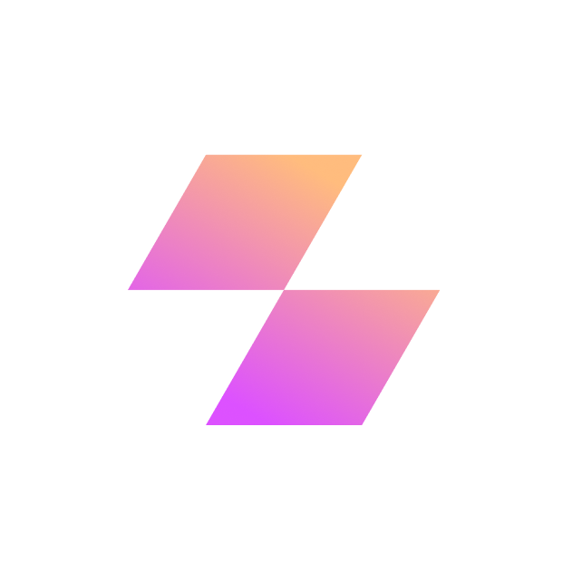

# NAVER AI RUSH 클론 웹페이지

## 💡 프로젝트 소개

이 페이지는 NAVER AI RUSH 프로그램을 소개하는 공식 사이트를 바탕으로 제작된 
클론 페이지입니다.
GSAP, Swiper, jQuery 등 다양한 기술을 사용하여 실제 웹처럼 동작하도록 구성했습니다.

### 🚀 사용 기술

- HTML5 / CSS3 (Reset, Layout, Media Query)
- JavaScript (ES6+)
- jQuery
- GSAP + ScrollTrigger
- Swiper.js (슬라이더)
- 반응형 웹 구현 (미디어 쿼리)

### 🧩 주요 기능

- 섹션별 고정/스크롤 효과
- 모바일 메뉴, 검색 모달
- 다크모드 스타일 전환
- Swiper 슬라이더
- 반응형 대응

### 📁 폴더 구조

```bash
복사편집
project/
├── index.html
├── css/
│   ├── reset.css
│   ├── common.css
│   ├── layout.css
│   ├── media.css
│   └── style.css
├── js/
│   └── script.js
├── img/
│   └── (이미지, 영상들)

```

> 🧩 역할 별 코드 정리
> 
- `reset.css` : 브라우저 기본 초기화
- `layout.css` : 전체 구조 및 배치
- `script.js` : GSAP/ScrollTrigger/JQuery 활용 인터랙션
- `media.css` : 화면 크기별 반응형 처리
- `common.css` : 공통 텍스트 및 버튼 스타일
- `index.html` : 전체 페이지 구조

## CODE

### html

```html
<!DOCTYPE html>
<html lang="en">

<head>
  <meta charset="UTF-8"> <!-- 문자 인코딩을 UTF-8로 설정 -->
  <meta name="viewport" content="width=device-width, initial-scale=1.0"> <!-- 반응형 설정 -->
  <title>Document</title> <!-- 브라우저 탭 제목 -->
  <link rel="stylesheet" href="./css/style.css"> <!-- 스타일시트 연결 (모든 CSS 통합됨) -->
</head>

<body class="">
  <!-- 모바일 메뉴 (햄버거 클릭 시 열림) -->
  <div class="modal-nav">
    <ul class="nav-list">
      <li><a href="#">ai rush</a></li>
      <li><a href="#">ai biz</a></li>
      <li><a href="#">ai study</a></li>
      <li><a href="#">notice</a></li>
    </ul>
  </div>

  <div class="overlay"></div> <!-- 모달 뒷배경용 오버레이 -->

  <!-- 상단 내비게이션 영역 -->
  <header>
    <div class="inner"> <!-- 가운데 정렬 및 최대 너비 설정 -->
      <h1>
        <a href="#" class="logo-link"> <!-- 로고 영역 -->
          <span class="blind">naver ai rush</span> <!-- 시각장애인을 위한 텍스트 -->
        </a>
      </h1>
      <nav>
        <ul class="nav-list"> <!-- 내비게이션 메뉴 -->
          <li><a href="#">ai rush</a></li>
          <li><a href="#">ai biz</a></li>
          <li><a href="#">ai study</a></li>
          <li><a href="#">notice</a></li>
        </ul>
        <a href="#" class="btn sch-btn">sch-btn</a> <!-- 검색 버튼 -->
        <a href="#" class="btn mob-nav-btn"></a> <!-- 모바일 햄버거 버튼 -->
      </nav>
    </div>

    <!-- 검색창 모달 -->
    <div class="sch-modal">
      <div class="sch-box">
        <button class="btn sch-modal-btn"> <!-- 닫기 버튼 -->
          <span class="blind">검색하기</span>
        </button>
        <input type="text" class="sch-bar" autofocus placeholder="관심있는 주제나 키워드를 검색해 보세요"> <!-- 검색 입력창 -->
      </div>
    </div>
    <div class="sch-modal-bg"></div> <!-- 검색창 뒤 배경 -->
  </header>

  <!-- 인트로 고정 섹션 (영상 포함) -->
  <section class="fixed-section">
    <div class="inner">
      <div class="t-wrap">
        <h2 class="s-tit">
           <!-- 인트로 이미지 -->
        </h2>
        <p class="s-txt">
          네이버 AI RUSH는 미래를 향한 다양한 파트너가 모여 <br>
          AI 기술, 경험, 노하우를 나누고 성장을 이어가는 프로그램입니다.
        </p>
        <a href="#" class="btn gradient">
          ai study 시작하기
        </a>
      </div>
    </div>

    <!-- 영상 롤링 효과 영역 -->
    <div class="rolling-wrap">
      <div class="rolling-in">
        <!-- 여러 개의 영상 반복 재생 -->
        <video autoplay muted loop class="rolling-content">
          <source src="./img/spot_rolling_01.mp4" type="video/mp4">
        </video>
        <!-- 반복적으로 영상 삽입 (총 12개) -->
        <!-- 생략된 다른 영상들도 동일한 형식 -->
      </div>
    </div>
  </section>

  <!-- 전체 페이지 내용이 담길 컨테이너 -->
  <div id="container">

    <!-- 섹션 1: 기술 흐름 소개 + 슬라이더 -->
    <section class="sc-section sc-section-1">
      <div class="inner">
        <h2 class="s-tit">
          주목해야할 AI 기술 흐름을 테마로 선정해 <br>
          다양한 AI 리더 그룹과 함께 <br>
          새로운 인사이트를 발견합니다.
        </h2>
        <h2 class="s-tit-moshow1"> <!-- 모바일용 제목 -->
          AI 기술을 테마로<br>
          다양한 AI 리더 그룹과<br>
          새로운 인사이트를<br>
          발견합니다.
        </h2>

        <!-- 슬라이더 설명 텍스트 + 버튼 -->
        <div class="flex-wrap">
          <p class="s-txt">
            대학생 앰배서더와 스타트업 파트너가 모여 <br>
            함께 나눈 HyperCLOVA X의 경험과 <br>트렌드를 확인해보세요.
          </p>
          <div class="arr-wrap">
            <div class="swiper-button-prev"></div>
            <div class="swiper-button-next"></div>
          </div>
        </div>

        <!-- 슬라이더 영역 -->
        <div class="sc1-slider-wrap">
          <div class="swiper sc1-slider">
            <div class="swiper-wrapper">
              <!-- 카드 1 -->
              <div class="swiper-slide">
                <a href="#">
                  <div class="img-wrap">
                    
                  </div>
                  <div class="t-wrap">
                    <h3>Ai를 일상에 적용하는 법: 대학생 편</h3>
                    <p class="txt">
                      <span>채널테크</span>
                      <span>앰배서더 활동 후기</span>
                    </p>
                  </div>
                </a>
              </div>
              <!-- 카드 2, 3도 동일한 형식으로 구성 -->
            </div>
          </div>
        </div>
      </div>
    </section>

    <!-- 섹션 2: 혜택 및 자격 -->
    <section class="sc-section sc-section-2">
      <div class="inner">
        <div class="t-wrap">
          <h2 class="s-tit">
            <span> AI 기술에 관심있는 대학생 앰배서더들과</span>
            <span>
              <a href="#" class="gradient-link">
                <div class="blind">hyper CLOVA X</div>
              </a> 의 사용 경험을 나누며</span>
            <span>
              AI 리더로 성장할 수 있는 기회를 만들어갑니다.
            </span>
          </h2>
          <h2 class="s-tit-moshow2"> <!-- 모바일 전용 -->
            대학생 앰배서더들과<br>
            <a href="#" class="gradient-link">
              <div class="blind">hyper CLOVA X</div>
            </a> 의 <br>
            경험을 통해 AI 리더로 성장 <br>
            하는 기회를 만들어갑니다.
          </h2>
        </div>

        <!-- 혜택 카드 리스트 -->
        <ul class="sc2-lst">
          <li> <!-- 카드 1 -->
            <div class="img-wrap">
              
            </div>
            <div class="card-txt-wrap">
              <h3>AI 활용 <br> 포트폴리오 도출</h3>
              <p>콘텐츠를 기획하고 제작할 수 있습니다.</p>
            </div>
          </li>
          <!-- 나머지 3개의 혜택 카드도 동일한 형식 -->
        </ul>

        <!-- 지원 자격 -->
        <div class="info-wrap info-wrap-1">
          <h4>앰배서더 지원 자격</h4>
          <ul class="info-lst">
            <li>2명~4명 팀 구성</li>
            <li>7월~9월 활동 가능자</li>
            <li>AI 기술 트렌드에 관심 있는 분</li>
          </ul>
        </div>
      </div>
    </section>

    <!-- 섹션 3: 활동 단계 및 예시 -->
    <section class="sc-section sc-section-3">
      <div class="inner">
        <div class="info-wrap info-wrap-2"> <!-- 3단계 프로그램 -->
          <h4>총 3단계 성장 프로그램이 진행됩니다.</h4>
          <ul class="info-lst">
            <li>
              <em class="num">01</em>
              <div class="in">
                <h5>AI 아이디어 도출</h5>
                <p>일상, 전공, 사회</p>
              </div>
            </li>
            <!-- 2, 3 단계도 동일 형식 -->
          </ul>
        </div>

        <!-- 활동 예시 3가지 -->
        <div class="info-wrap info-wrap-3">
          <h4>AI 아이디어 예시</h4>
          <ul class="info-lst">
            <li>
              <h5>AI Experience</h5>
              <p class="sm-tit">일상 기반 아이디어</p>
              <p>건강, 취미 등 변화 필요성 해결</p>
            </li>
            <!-- 나머지 2개도 동일 형식 -->
          </ul>
        </div>

        <!-- 진행 일정 -->
        <div class="info-wrap info-wrap-4">
          <h4>진행일정</h4>
          <ul class="info-lst">
            <li>
              <div class="left">
                <em class="num">1</em>
                <h5>앰배서더 참가 지원</h5>
              </div>
              <div class="right">
                <div class="date">7월 3일까지</div>
              </div>
            </li>
            <!-- 발표일, 운영 기간도 동일 형식 -->
          </ul>
        </div>
      </div>
    </section>
  </div>

  <!-- 결과 섹션 -->
  <section class="result-section">
    <div class="inner">
      <div class="t-wrap">
        <h2 class="s-tit">
          AI RUSH 프로그램 결과물 소개
        </h2>
        <a href="#" class="arrow"></a> <!-- 화살표 -->
      </div>
      <ul class="result-lst">
        <li>
          <a href="#">
            <div class="img-wrap">
              <video class="card_video" autoplay muted loop>
                <source src="./img/rush2024_biz_video_1.mp4" type="video/mp4">
              </video>
            </div>
            <div class="result-t-box">
              <h4 class="tit">캐릭터 AI 아바타 챗봇</h4>
              <p class="txt">굳갱랩스</p>
            </div>
          </a>
        </li>
        <!-- 나머지 결과들도 같은 형식으로 반복 -->
      </ul>
    </div>
  </section>

  <!-- 하단 푸터 -->
  <footer>
    <div class="inner in1">
      <div class="left">
        <h2 class="tit">
          네이버 AI와 HyperCLOVA X에 관한 <br>
          핵심 콘텐츠를 확인해보세요!
        </h2>
        <a href="#" class="qna">
          <span> 자주 묻는 질문 </span>
          <i class="ico"></i>
        </a>
      </div>
      <div class="btn gradient">
        ai study 시작하기
      </div>
    </div>
    <div class="inner in2">
      <div class="copy">
        © NAVER Cloud Corp.
      </div>
      <div class="info">
        <a href="#">개인정보처리방침</a>
        <a href="#">고객센터</a>
      </div>
    </div>
  </footer>

  <!-- 외부 스크립트 연결 -->
  <script src="https://cdnjs.cloudflare.com/ajax/libs/gsap/3.12.2/gsap.min.js"></script>
  <script src="https://cdnjs.cloudflare.com/ajax/libs/gsap/3.12.2/ScrollTrigger.min.js"></script>
  <script src="https://cdn.jsdelivr.net/npm/swiper@11/swiper-bundle.min.js"></script>
  <script src="https://cdnjs.cloudflare.com/ajax/libs/jquery/3.7.1/jquery.min.js"></script>
  <script src="./js/script.js"></script> <!-- 메인 스크립트 -->
</body>
</html>
```

### css

### reset.css

```css
/* reset.css - 브라우저 기본 스타일 초기화 및 기본 폰트 세팅 */

/* 웹 폰트 및 외부 라이브러리 스타일 불러오기 */
@import url('https://fonts.cdnfonts.com/css/nanumsquare-neo'); /* 나눔스퀘어 네오 폰트 */
@import url('https://cdn.jsdelivr.net/npm/swiper@11/swiper-bundle.min.css'); /* swiper 슬라이더 스타일 */

/* 기본 폰트 크기를 62.5%로 지정 (1rem = 10px이 되도록 설정) */
html {
    font-size: 62.5%;
}

/* 수평 스크롤 방지 */
html, body {
    overflow-x: hidden;
}

/* 모든 요소에 margin, padding 제거하고 box-sizing 설정 */
* {
    margin: 0;
    padding: 0;
    box-sizing: border-box;
}

/* HTML5 시맨틱 태그들을 블록 요소로 설정 */
article,
aside,
details,
figcaption,
figure,
footer,
header,
hgroup,
menu,
nav,
section {
    display: block;
}

/* 기본 폰트 설정 */
body {
    line-height: 1; /* 줄 간격 기본값 */
    font-family: 'NanumSquare Neo', sans-serif; /* 기본 폰트 */
}

/* 리스트 스타일 제거 */
ol,
ul {
    list-style: none;
}

/* a 태그의 밑줄 제거 및 색상 상속 */
a {
    text-decoration: none;
    color: inherit;
}

/* 테이블 스타일 초기화 */
table {
    border-collapse: collapse; /* 테두리 겹침 제거 */
    border-spacing: 0;
}

/* 이미지와 비디오가 컨테이너보다 넘치지 않도록 설정 */
img,
video {
    max-width: 100%;
    height: auto;
}

/* 폼 요소의 기본 스타일 제거 */
button,
input,
optgroup,
select,
textarea {
    margin: 0;
    padding: 0;
    border: 0;
    font-size: 100%;
    font-family: inherit;
    vertical-align: baseline;
}

/* 포커스 시 외곽선 제거 */
button:focus,
input:focus,
optgroup:focus,
select:focus,
textarea:focus {
    outline: none;
}

/* 인용문 스타일 제거 */
blockquote,
q {
    quotes: none;
}

blockquote:before,
blockquote:after,
q:before,
q:after {
    content: '';
    content: none;
}
```

### common.css

```css
/* common.css - 전체 공통 스타일 및 텍스트/버튼 디자인 설정 */

/* 주요 영역(section, header, footer)에 기본적인 크기 지정 */
section,
header,
footer {
    position: relative; /* 상대 위치 지정 */
    width: 100%; /* 전체 너비 사용 */
}

/* 안쪽 콘텐츠를 정렬하기 위한 공통 클래스 */
.inner {
    max-width: 136rem; /* 최대 너비 1360px */
    margin: auto;      /* 가운데 정렬 */
    height: 100%;
    position: relative;
}

/* 모든 제목과 문단, 내비게이션 텍스트 대문자화 */
h1,
h2,
h3,
h4,
h5,
h6,
nav,
p {
    text-transform: uppercase; /* 대문자로 표시 */
}

/* 시각적으로 숨기지만 스크린리더용으로 유지 */
.blind {
    display: none;
}

/* 공통 버튼 스타일 */
.btn {
    display: inline-flex;        /* 인라인 플렉스 구조 */
    align-items: center;         /* 세로 중앙 정렬 */
    padding: 0 4.8rem;           /* 좌우 여백 */
    font-size: 2.6rem;
    height: 7rem;                /* 버튼 높이 */
    color: #fff;                /* 흰색 텍스트 */
    text-transform: uppercase;   /* 대문자 */
}

/* 그라데이션 배경 (버튼 등에서 사용) */
.gradient {
    background: rgb(208,59,168);
    background: linear-gradient(90deg, rgba(208,59,168,1) 0%, rgba(65,162,247,1) 100%);
}

/* 큰 제목 스타일 */
h2.s-tit {
    font-size: 5rem;
    font-weight: bold;
    line-height: 7.5rem;
}

/* 설명 텍스트 스타일 */
p.s-txt {
    font-size: 2.6rem;
    line-height: 4.2rem;
    font-weight: 700;
}

/* 플렉스 정렬용 래퍼 */
.flex-wrap {
    display: flex;
}

/* 텍스트 롤링 애니메이션 (왼쪽으로 이동) */
@keyframes rolling {
    0% {
        transform: translateX(0);
    }
    100% {
        transform: translateX(-50%);
    }
}

/* 배경 그라데이션 움직이는 애니메이션 */
@keyframes gradientMove {
    0% {
        background-position: 0% 50%;
    }
    50% {
        background-position: 100% 50%;
    }
    100% {
        background-position: 0% 50%;
    }
}

/* 카드 내 텍스트 영역 상단 여백 및 선 */
.card-txt-wrap {
    margin-top: 3rem;
    border-top: 0.1rem solid rgba(255, 255, 255, 0.1);
}

.card-txt-wrap h3 {
    font-size: 2.5rem;
    font-weight: 700;
    line-height: 2.9rem;
}

.card-txt-wrap p {
    font-size: 1.6rem;
    line-height: 2.7rem;
    margin-top: 1.5rem;
}

/* 정보 영역 제목 */
.info-wrap h4 {
    font-size: 3rem;
    font-weight: bold;
}

/* 리스트 항목 제목 */
.info-lst h5 {
    font-size: 2.4rem;
    letter-spacing: -0.01rem;
    font-weight: 600;
    margin: 2.1rem 0 1.6rem;
}

/* 숫자 강조 스타일 */
.info-lst .num {
    font-size: 2.4rem;
    font-weight: 800;
}

/* info-wrap이 연달아 있을 경우 위쪽 패딩 추가 */
.info-wrap + .info-wrap {
    padding-top: 23rem;
}
```

### layout.css

```css
/* layout.css - 페이지의 전체 구조 및 배치, 섹션 스타일 담당 */

/* 모바일 내비게이션 버튼 기본값 숨김 */
.mob-nav-btn {
    display: none;
}

/* 상단 헤더 위치와 기본 애니메이션 */
header {
    position: absolute;
    z-index: 5;
    top: 0;
    height: 8.8rem;
    transform: translateY(-100%); /* 처음에는 위로 숨김 */
    transition: all .3s ease-in-out;
}

/* 페이지 로드시 헤더가 아래로 내려오게 함 */
header.load {
    transform: translateY(0);
}

/* 스크롤 시 헤더 고정 */
header.up {
    position: fixed;
}

/* 다크모드에서 고정 헤더의 배경을 그라데이션 블랙으로 변경 */
body.dark header.up {
    background: linear-gradient(0deg, rgba(0,0,0,0) 0%, rgba(0,0,0,1) 100%);
}

/* 헤더 내부 레이아웃 정렬 */
header .inner {
    display: flex;
    justify-content: space-between;
    align-items: center;
    max-width: 151.4rem;
}

/* 로고 이미지 백그라운드 설정 */
.logo-link {
    display: block;
    width: 20.3rem;
    height: 3rem;
    background: url(../img/logo_naver_ai_rush.svg) no-repeat center/100%;
}

/* 내비게이션 리스트 정렬 */
nav {
    display: flex;
    gap: 6.2rem;
}

.nav-list {
    display: flex;
    gap: 6.5rem;
}

.nav-list a {
    font-weight: 700;
    line-height: 2.8rem;
    font-size: 1.6rem;
}

/* 검색 버튼 아이콘 */
nav .sch-btn {
    width: 1.8rem;
    height: 1.8rem;
    font-size: 0;
    background: url(../img/header-sch.png) no-repeat center/contain;
    padding: 0;
}

/* 고정된 상단 인트로 섹션 */
.fixed-section {
    position: fixed;
    height: 100vh;
    width: 100%;
    z-index: 2;
    top: 0;
    background-color: #fff;
    padding-top: 14.5rem;
}

/* 고정 섹션 내부 정렬 */
.fixed-section .inner {
    height: auto;
    display: flex;
    flex-direction: column;
    text-align: center;
    justify-content: flex-end;
}

/* 고정 섹션의 제목 너비 제한 */
.fixed-section h2.s-tit {
    max-width: 70rem;
    margin: auto;
}

.fixed-section p.s-txt {
    margin: 4.6rem auto 5rem;
}

/* 롤링 영역: 영상들이 좌우로 이동하는 효과 */
.rolling-wrap {
    overflow: hidden;
    margin-top: 10rem;
    white-space: nowrap;
    position: absolute;
}

.rolling-in {
    display: flex;
    width: max-content;
    animation: rolling 30s linear infinite;
}

.rolling-in video {
    width: 39rem;
}

/* 메인 컨테이너 */
#container {
    padding-top: 100vh; /* fixed-section 아래에 위치하도록 */
    padding-bottom: 100vh; /* result-section 고정 위치 확보 */
    position: relative;
    width: 100%;
}

/* 각 스크롤 섹션 */
#container .sc-section {
    background-color: #fff;
    height: 100vh;
    z-index: 3;
    padding: 20rem 0;
    transition: background-color 1s ease-in-out;
}

/* 다크모드 스타일 */
body.dark #container .sc-section {
    background-color: #000;
    color: #fff;
}

body.dark #container .sc-section * {
    color: #fff;
}

/* 다크모드 로고, 내비게이션, 검색 아이콘 교체 */
body.dark header.up .logo-link {
    background-image: url(../img/logo_naver_ai_rush_white.svg);
}

body.dark header.up .nav-list a {
    color: #fff;
}

body.dark header.up nav .sch-btn {
    background-image: url(../img/header-sch-wh.png);
}

```

### media.css

```jsx
/* media.css - 반응형 웹을 위한 스타일 (브레이크포인트별 레이아웃 조정) */

/* 화면 너비가 1514px 이하일 때 */
@media screen and (max-width:1514px) {
    .result-lst {
        gap: 1rem; /* 결과물 간격 축소 */
    }

    .inner {
        padding: 0 3rem; /* 양쪽 여백 확보 */
    }

    /* 모바일 내비게이션 메뉴 */
    .modal-nav {
        display: block;
        position: fixed;
        width: 100%;
        background-color: #fff;
        z-index: 6;
        top: -110%;
        padding: 6.8rem 3rem;
        text-align: center;
        transition: top .3s;
    }

    /* 모바일 메뉴 항목 세로 정렬 */
    .modal-nav .nav-list {
        flex-direction: column;
    }

    /* 모바일 내비게이션 링크 스타일 */
    .modal-nav .nav-list li a {
        font-size: 2rem;
        font-weight: 900;
        line-height: 3.2rem;
        text-transform: uppercase;
    }

    nav {
        gap: 2rem; /* 내비게이션 간격 축소 */
    }

    /* 햄버거 메뉴 버튼 */
    .btn.mob-nav-btn {
        display: block;
        width: 1.8rem;
        height: 1.8rem;
        background: url(../img/hamburger-bl.svg) no-repeat center/contain;
        font-size: 0;
        padding: 0;
    }

    header .nav-list {
        display: none; /* 데스크탑 내비게이션 숨김 */
    }

    .show-modal-nav .modal-nav {
        top: 0; /* 햄버거 클릭 시 메뉴 표시 */
    }

    .show-modal-nav .overlay {
        visibility: visible;
    }

    .show-modal-nav header {
        z-index: 7;
    }

    .show-modal-nav nav .sch-btn,
    .show-modal-nav header h1 {
        visibility: hidden;
    }

    .show-modal-nav .mob-nav-btn {
        background-image: url(../img/modal-nav-close.svg);
    }

    .btn {
        padding: 0 3rem;
        font-size: 1.5rem;
        height: 5rem;
    }

    #container .sc-section {
        padding: 16rem 0;
    }

    h2.s-tit {
        font-size: 4rem;
        line-height: 6rem;
    }

    p.s-txt {
        font-size: 2.1rem;
        line-height: 3.3rem;
    }

    .card-txt-wrap h3 {
        font-size: 1.8rem;
        line-height: 2.6rem;
    }

    .card-txt-wrap p {
        font-size: 1.3rem;
        line-height: 2.2rem;
    }

    .info-wrap h4 {
        font-size: 2.4rem;
        line-height: 3.8rem;
    }

    .fixed-section h2.s-tit {
        width: 56.5rem;
    }

    .fixed-section p.s-txt {
        margin: 3.8rem 0 4rem;
    }

    .sc-section-1 .flex-wrap {
        margin: 13rem 0 5.3rem;
    }

    .sc1-slider {
        width: 57.8rem;
    }

    .sc1-slider .t-wrap h3 {
        font-size: 1.8rem;
        line-height: 2.6rem;
        margin: 2rem 0 1.5rem;
    }

    .gradient-link {
        height: 5.6rem;
    }

    .sc-section-2 .sc2-lst {
        gap: 1.2rem;
    }

    .info-wrap-1 .info-lst li {
        font-size: 1.8rem;
        line-height: 2.1rem;
    }

    .info-wrap-1 .info-lst li+li {
        margin-top: 1.8rem;
    }

    .info-wrap-2 .info-lst {
        gap: 2rem;
    }

    .info-wrap-2 .info-lst li {
        width: 27rem;
        height: 27rem;
    }

    .info-lst .num {
        font-size: 1.8rem;
    }

    .info-lst h5,
    .info-wrap-2 .info-lst li h5 {
        font-size: 2.2rem;
    }

    .info-wrap-3 .info-lst p,
    .info-wrap-2 .info-lst li p {
        font-size: 1.6rem;
        line-height: 2rem;
    }

    .info-wrap-3 .info-lst p.sm-tit {
        font-size: 1.2rem;
    }

    .info-wrap-4 .info-lst li {
        padding: 2rem;
    }

    body.dark header.up nav .btn.mob-nav-btn {
        background-image: url(../img/hamburger-wh.svg);
    }
}

/* 이하 생략 (1200px 이하, 767px 이하에서 구조 변경) */
```

### style.css

```jsx
@import url(reset.css);
@import url(https://cdn.jsdelivr.net/npm/swiper@11/swiper-bundle.min.css);
@import url(common.css);
@import url(layout.css);
@import url(media.css);
```

### javascript

```jsx
// script.js - 페이지 동작, 애니메이션, 인터랙션 구현

// HTML 로드 완료 후 실행
window.addEventListener('DOMContentLoaded', () => {

    // GSAP의 ScrollTrigger 플러그인 등록
    gsap.registerPlugin(ScrollTrigger);

    // 주요 요소들 변수로 지정
    const header = document.querySelector('header');
    const fixedSc = document.querySelector('.fixed-section');
    const container = document.querySelector('#container');
    const body = document.querySelector('body');
    const sc1 = document.querySelector('.sc-section-1');
    const sc3 = document.querySelector('.sc-section-3');
    const resultSc = document.querySelector('.result-section');
    const mobNavBtn = document.querySelector('.mob-nav-btn');

    let hasEntered = false; // resultSection 노출 여부 저장

    // 모바일 내비게이션 버튼 클릭 시 메뉴 열기/닫기
    mobNavBtn.addEventListener('click', (e) => {
        e.preventDefault();
        body.classList.toggle('show-modal-nav');
    });

    // (5) section-1의 bottom이 viewport top에 닿을 때 fixed-section 숨기기
    ScrollTrigger.create({
        trigger: sc1,
        start: 'bottom top',
        onEnter: () => gsap.set(fixedSc, { zIndex: -1 }), // 사라짐
        onLeaveBack: () => gsap.set(fixedSc, { zIndex: 2 }) // 다시 보이게
    });

    // (6) result-section이 viewport에 들어오면 position 바꾸기
    window.addEventListener('scroll', () => {
        const rect = sc3.getBoundingClientRect(); // sc3의 위치 측정
        const sc3BottomVp = rect.bottom <= 5; // sc3가 거의 화면 위로 사라졌는지 여부

        if (sc3BottomVp && !hasEntered) {
            resultSc.style.position = 'relative';
            resultSc.style.zIndex = '1';
            container.style.paddingBottom = '0';
            hasEntered = true;
        } else if (!sc3BottomVp && hasEntered) {
            resultSc.style.position = 'fixed';
            resultSc.style.zIndex = '-1';
            container.style.paddingBottom = '100vh';
            hasEntered = false;
        }
    });

    // (1) header load 시 애니메이션
    header.classList.add('load');

    // (2) 스크롤 방향에 따라 header 표시 여부
    window.addEventListener('wheel', (event) => {
        if (event.deltaY < 0) { // 위로 스크롤
            header.classList.add('up');
            if (window.scrollY === 0) {
                header.classList.remove('up');
            }
        } else { // 아래로 스크롤
            header.classList.remove('up');
        }
    });

    // (3) fixed-section 배경 점차 어둡게
    gsap.to(fixedSc, {
        backgroundColor: '#000',
        ease: 'power2.out',
        scrollTrigger: {
            trigger: container,
            start: 'top top',
            end: 'bottom top',
            scrub: true
        }
    });

    // (4) dark 클래스 toggle - sc1 지나갈 때 body에 dark 클래스 적용
    gsap.to(sc1, {
        scrollTrigger: {
            trigger: sc1,
            start: 'bottom 70%',
            end: 'bottom 75%',
            scrub: true,
            onEnter: () => body.classList.add('dark'),
            onLeaveBack: () => body.classList.remove('dark')
        }
    });

    /* jQuery로 검색창 관련 모달 제어 */
    $(function () {
        const navSchBtn = $('nav .sch-btn');
        const body = $('body');
        const schModalBg = $('.sch-modal-bg');
        const overlay = $('.overlay');

        // 검색 버튼 클릭 시 모달 열기
        navSchBtn.on('click', function (e) {
            e.preventDefault();
            schModalBg.slideDown();
            setTimeout(function () {
                body.addClass('sch-modal-open');
            }, 200);
        });

        // 오버레이 클릭 시 모달 닫기
        overlay.on('click', function (e) {
            e.preventDefault();
            schModalBg.slideUp();
            setTimeout(function () {
                body.removeClass('sch-modal-open');
            }, 200);
        });
    });

    // Swiper 슬라이더 초기화 (section-1에서 사용)
    const sc1Slider = new Swiper(".sc1-slider", {
        navigation: {
            nextEl: ".sc-section-1 .swiper-button-next",
            prevEl: ".sc-section-1 .swiper-button-prev",
        },
        spaceBetween: 30,
        slidesPerView: 1
    });
});

```
